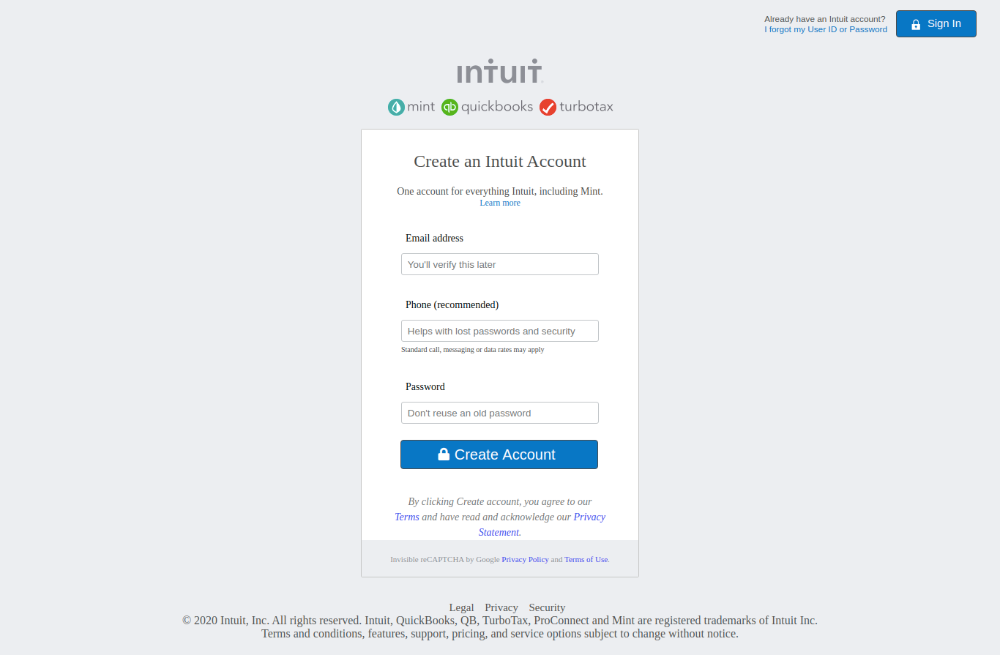

# Html-forms

> This project consists of building an HTML document that matches the appearance of mint.com’s signup page.

The project was a collaboration. The project uses basic html5 and css3.

## Built With

- HTML5
- CSS3.

## Live Demo

[Live Demo Link](https://morrism1.github.io/Html-forms/)

## Getting Started

This is a basic HTML5 and CSS3 webpage that is static. Simply clone or download the files from the github repo and click on index.html to launch the webpage.

## Authors

👤 **Author1**

- Github: [@menyagah](https://github.com/menyagah)
- Twitter: [@Martinnyaga20](https://twitter.com/Martinnyaga20)
- Linkedin: [linkedin](https://linkedin.com/linkedinhandle)

👤 **Author2**

- Github: [@Morrism1](https://github.com/Morrism1)
- Twitter: [@MorrisMontana0](https://twitter.com/MorrisMontana0)
- Linkedin: [Maurice Murangwa](https://www.linkedin.com/in/murangwa-maurice-769549140/)

## 🤝 Contributing

Contributions, issues and feature requests are welcome!

Feel free to check the [issues page](issues/).

## Show your support

Give a ⭐️ if you like this project!

## 📝 License

This project is [MIT](lic.url) licensed.
